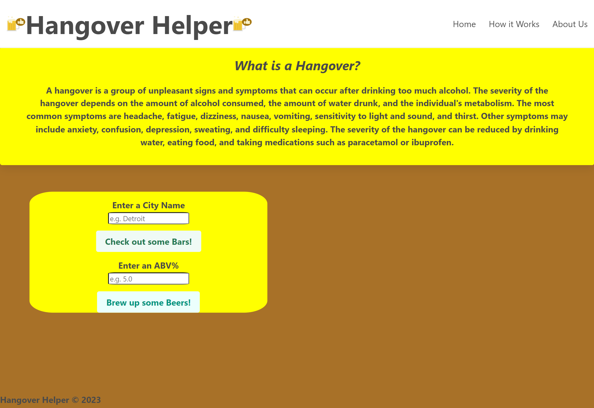

# Hangover Helper

## Description

We wanted to build this web application to solve two common problems, that usually happen at the same time, finding a beer you want to drink for the night, and finding the best brewery in town to do so! This application is easy to use and is targeted for adults who want to go out and find a new brewery or their new favorite drink.We also wanted to make the website to showcase our skills that we've learned throughout out first couple of months learning HTML, CSS, and JavaScript. Specifically in the cases of API's and using CSS frameworks like Bulma (the framework we used.) We learned a lot while building this project about teamwork, and that it's a solid experience working with others and building an entire, fully-functional web page.

## Usage

Hangover Helper is meant to be used to look up bars near a city and beers above a certain ABV%. The way you would search up a brewery is by typing a city name, such as Detroit, into the text box below "Enter A City Name" and then left clicking the button just below that. This is going to display a number of breweries in that city to the right using JavaScript paired with the Open Brewery API. The way to find a beer with an ABV above a certain percentage: the user is going to do almost the same exact same thing here, except a city name they will enter a numerical value into the search bar underneath "Enter an ABV%." Left clicking the "Home" button in the top right will reset the page so that anything searched will disappear, making it less cluttered if too many things are searched. The "About Us" button displays a modal with some information about our team that developed this wonderful application. The user can also click the "How it Works" button to display a modal with all of the information displayed here as well.

Link to the deployed web application:  https://maryvda.github.io/Hangover-helper/

## Credits

Here’s a list of the people who created this web application and a link to each of their GitHub profiles!

Nick Loeffler
https://github.com/NickLoeffler999

Alvin Turner
https://github.com/ATurner3x

Mary Dault
https://github.com/MaryVDa

Malik Burrus
https://github.com/malikburrus0

We used two different API’s, one to display breweries near a city, and one to display beers above a certain alcohol percentage. The first API we used to get the beer data is the Punk API: https://punkapi.com/documentation/v2. The next API we used to fetch up breweries by city name was the Open Brewery API here: https://www.openbrewerydb.org/documentation. These API's supply the data needed for our website to function properly, so we absolutely had to give credit here.

We also used dDara’s Beer Icons for our web application to add a little bit of extra styling to our title.
Link ro their website: https://www.flaticon.com/free-icons/beer

## License

Please refer to the license in the repo.
